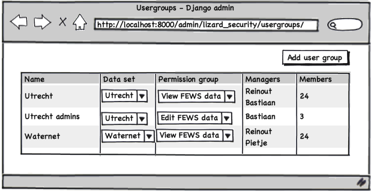

Code: our models for managing security
=======================================

.. automodule:: lizard_security.models
   :members:

Code: middleware that sets data sets and user groups in the request
====================================================================

.. automodule:: lizard_security.middleware
   :members:

Code: custom model manager that filters
=======================================

.. automodule:: lizard_security.manager
   :members:

Code: backend for permission handling
=====================================

.. automodule:: lizard_security.backends
   :members:

Code: admin interface (both for our own and the one for re-use)
===============================================================

.. automodule:: lizard_security.admin
   :members:

.. include:: ../../lizard_security/object_filtering.rst
